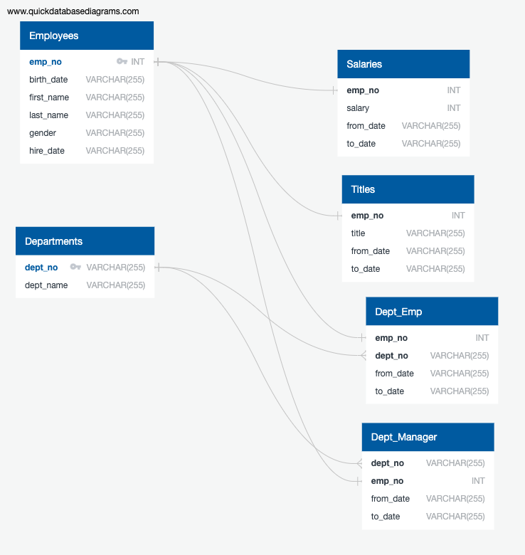

# Employee SQL Project

## Background
* Analyze database of employees from a corporation from the 1980s and 1990s. 
* Project is twofold: data engineering/modeling and data analysis
  * Design tables to hold data in the CSVs and import the CSVs into a SQL database
  * Find insights into data.
  
### Data Modeling
* Sketch out ERD

  

### Data Engineering
* Create table schema for each CSV files
* Import each CSV file into corresponding SQL table

### Data Analysis
* List the following details of each employee: employee number, last name, first name, gender, and salary.
* List employees who were hired in 1986.
* List the manager of each department with the following information: department number, department name, the manager's employee number, last name, first name, and start and end employment dates.
* List the department of each employee with the following information: employee number, last name, first name, and department name.
* List all employees whose first name is "Hercules" and last names begin with "B."
* List all employees in the Sales department, including their employee number, last name, first name, and department name.
* List all employees in the Sales and Development departments, including their employee number, last name, first name, and department name.
* In descending order, list the frequency count of employee last names, i.e., how many employees share each last name.

* Visualize data by importing the SQL database into Pandas
  * Create histogram to visualize the most common salary ranges for employees
  * Create a bar chart of average salary by title
